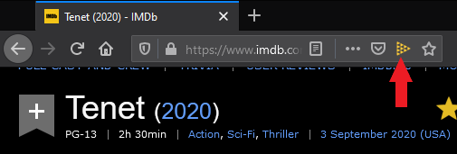

# imdb2justwatch

[Install from the add-on page](https://addons.mozilla.org/en-US/firefox/addon/imdb2justwatch/)

A Firefox add-on that provides an address bar button on IMDb pages that takes you to the relevant Just Watch page.

